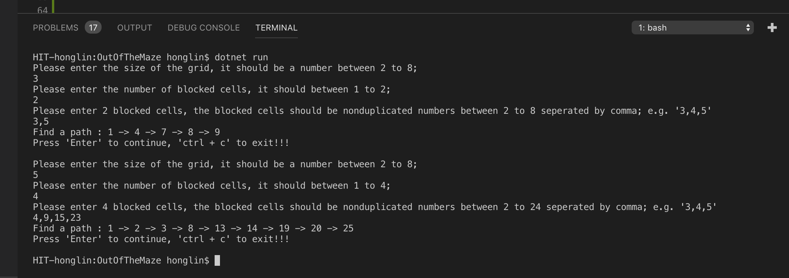
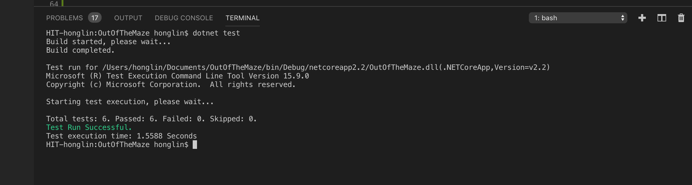

# Problem Statement

Assume a grid with m columns and m rows (m x m). For identification, each cell in the grid is numbered from left to right, top to bottom.Some cells in the grid might be blocked, in which case, the cell number will be set to 0. Find a path (any path) that connects from first cell at the top left (number = 1) to the last cell at the bottom right (number = m * m) without going through the blocked cells and print the path. If there is no path, the output should be 'No path available'.

You can assume the first and the last cells will never be blocked.

For example, if m = 3, for 3 * 3 grid, the grid cells will be numbered as follows.

|   1	|   2	|   3	|\
|   4	|   5	|   6	|\
|   7	|   8	|   9	|

In this grid, if cell number 3 and 5 are blocked, then it will look as follows.

|   1	|   2	|   0	|\
|   4	|   0	|   6	|\
|   7	|   8	|   9	|

So, the possible path from cell 1 to cell 9 is: 1 -> 4 -> 7 -> 8 -> 9

### Requirement:
* At the start of the console application, the user should be asked
* The grid size (m). m can be 2 to 8
* The number of blocked cells (x). x should between 1 and <= m - 1
* Based on the number of x, ask the user to enter the cell number of the blocked cells. The first and last cells should not be blocked. The user should not be able to block the cells that are already blocked. The application should then output the path from the first cell to the last cell if it exists, otherwise it should output 'No path available'.
* Unit tests are recommended as they would demonstrate that you have tested your solution.
  
We will look a correct solution and review the coding style, class design and documentation.
Please let us know if you have questions or need more time.

## Solution
This is a small console application build by Dotnet core. 
It is recommended to use "VS Code" to open the source code.

### Prerequisite:

* DotNetCore 2.2 (['download dotnet core'](https://dotnet.microsoft.com/download/dotnet-core/2.2))
* VS Code

### Project Structure:

### Execution Steps: 

* Clone Source Code from Github (git clone https://github.com/yanghl22/OutOfTheMaze.git )
* Open project with VS Code
* Run 'dotnet restore' to install the packages (optional).
* Run 'dotnet run' to start the console app.
* Run 'dotnet test' to execute unit test.

<strong>Note: <em>Project is only tested on Mac Evn. Do necessary change if Windows is not working. </em></strong>

### Execution result:

Screenshots :

### Execution Test:

Screenshot:

## End

